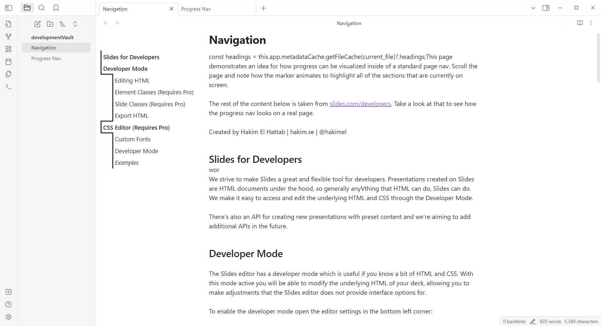

# Obsidian-Navigation

插件未完工
- 原本想给目录的 li 添加监听器然后用 setEphemeralState 实现跳转，但是不知道为啥没能跳转
- ob 会自动清除未在页面中显示的 dom，因此无法用 querySelectorAll(.workspace-leaf.mod-active .cm-header-2, .workspace-leaf.mod-active .cm-header-3) 获取所有二三级标题。原本预计获取到标题的dom后添加id，借助id实现在sync()中的getElemntById，以此获取各个getBoundingClientRect，现在由于ob的清除机制无法实现。不过这个机制的存在可以让ob打开超长文件也不卡顿。

目前的进度

目标样式

